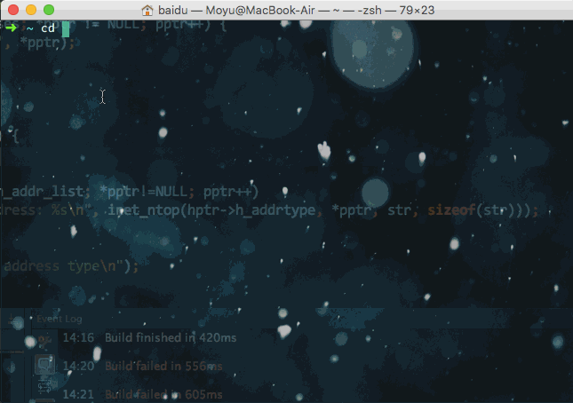
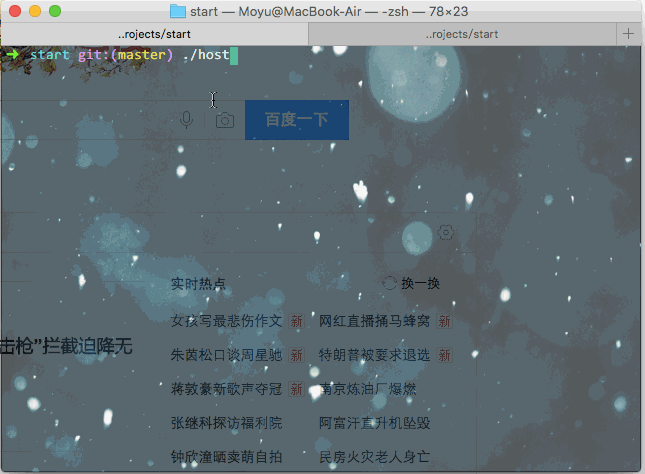

# c/c++ & node c/c++ addon


## directory tree

```sh
/
├── build.sh            # build all cpp_src files by g++. (sh build.sh)
├── cpp_src/
│   ├── hostname.cpp    # get domain name's ip, command arguments [baidu.com]
│   ├── client.cpp      # tcp client, command arguments [ip] [port]
│   ├── client.h
│   ├── iofuncs.cpp     # c standard lib about io
│   ├── main.cpp        # test
│   ├── printlist.cpp   # variable arguments & print format %s
│   ├── server.cpp      # tcp server, command arguments [ip] [port]
│   ├── server.h
│   ├── strfuncs.cpp    # c standard lib about string
│   ├── sysio.cpp       # unix sys call about io
│   ├── sysioflags.cpp  # unix sys call about io
│   ├── shell.cpp       # c shell by unix sys call
│   └── sysmmap.cpp     # unix sys call about mmap
├── dir.sh              # get directory tree string (need node package `print-dir`)
├── hellp               # `cpp_src/sysmmap.cpp` need this file.
├── node_src/           # node files.
│   ├── addon.cpp       # connect node & c/c++
│   ├── binding.gyp     # config file
│   ├── client.js
│   ├── package.json
│   └── server.js
└── README.md

4 directories, 26 files.
```

## have a look

- tcp (server & client)



- gethostbyname 



## get started

1. tcp
    - pure c/c++
        ```sh
        # clone this repo & after installed g++ on linux or mac.
        sh build.sh
    
        ./server.out # run server
    
        # run client on another shell.
        # after connected to server successfully
        # you can input some string and type enter, that will be sent to server.
        ./client.out
        ```
    
    - node c/c++ addon
        ```sh
        # clone this repo & after installed node 6+ on linux or mac.
        cd node_src
        npm install
        sudo npm install -g node-gyp
        node-gyp rebuild
    
        node server.js  # run server
    
        # run client on another shell.
        node client.out
        ```

2. c Shell

    ```sh
    sh build.sh cpp_src/shell.cpp
    ./mv.sh # sh mv.sh
    
    shell # anywhere
    ```

## More

- [linux C book online](http://akaedu.github.io/book/ch37s02.html#id2904122)
- [shell redirect & /dev/*](http://akaedu.github.io/book/ch28s06.html)
- [v8 document](https://v8docs.nodesource.com/node-6.0/dc/d0a/classv8_1_1_value.html)
- [node-addon-examples](https://github.com/nodejs/node-addon-examples/)